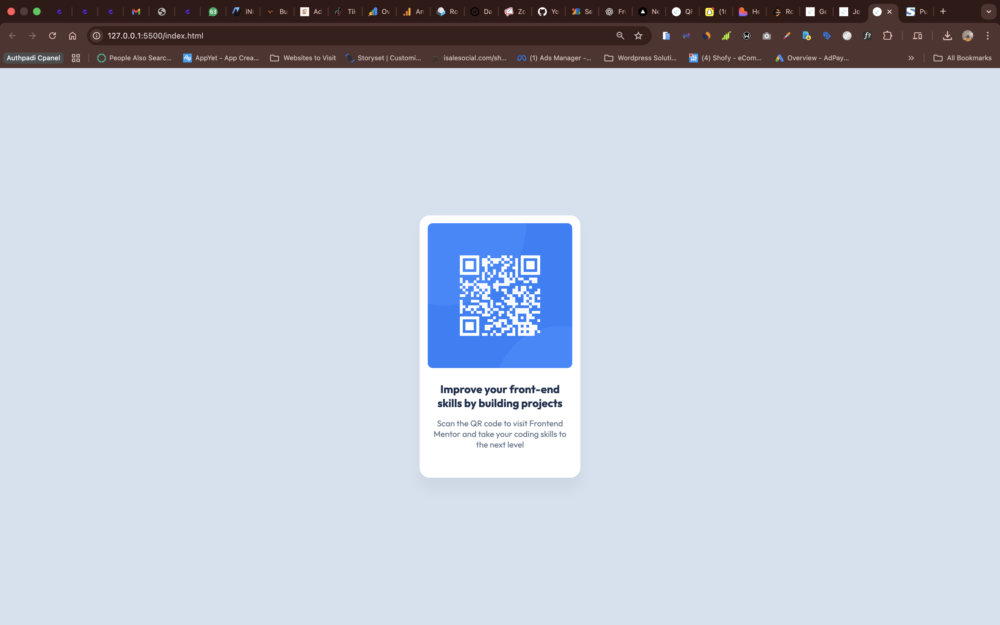
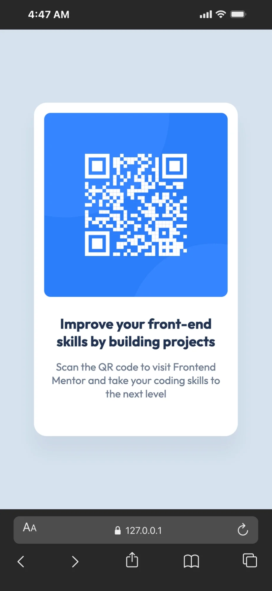

Frontend Mentor - QR Code Component Solution

This is my solution to the QR Code Component challenge on Frontend Mentor.
It focuses on building a clean, centered card layout using semantic HTML and modern CSS techniques.

📌 Overview
🔗 The Challenge

Build a responsive QR code component that matches the provided design as closely as possible.

Users should be able to:

View the optimal layout depending on their device's screen size

🖼 Screenshot
Desktop

Mobile

🔗 Links

Solution URL: https://www.frontendmentor.io/solutions/your-solution-link

Live Site URL: https://qr-code-component-seven-swart.vercel.app/

🛠 Built With

Semantic HTML5

CSS3

Flexbox

Mobile-first workflow

Google Fonts (Outfit)

📂 What I Learned

While building this project, I reinforced:

Proper use of Flexbox for centering content

Spacing consistency using padding and margin

Using box-sizing: border-box to prevent layout issues

Creating reusable and clean CSS structure

Implementing responsive design principles

💭 Continued Development

In future projects, I want to:

Improve accessibility practices

Strengthen layout precision

Explore CSS Grid more deeply

Practice writing cleaner, more scalable CSS

📚 Useful Resources

MDN Web Docs

CSS Tricks

Frontend Mentor Community

👤 Author

Frontend Mentor – @sammyloaded

GitHub – https://github.com/sammyloaded

🙌 Acknowledgments

Thanks to Frontend Mentor for providing real-world practice challenges that help improve frontend skills.
